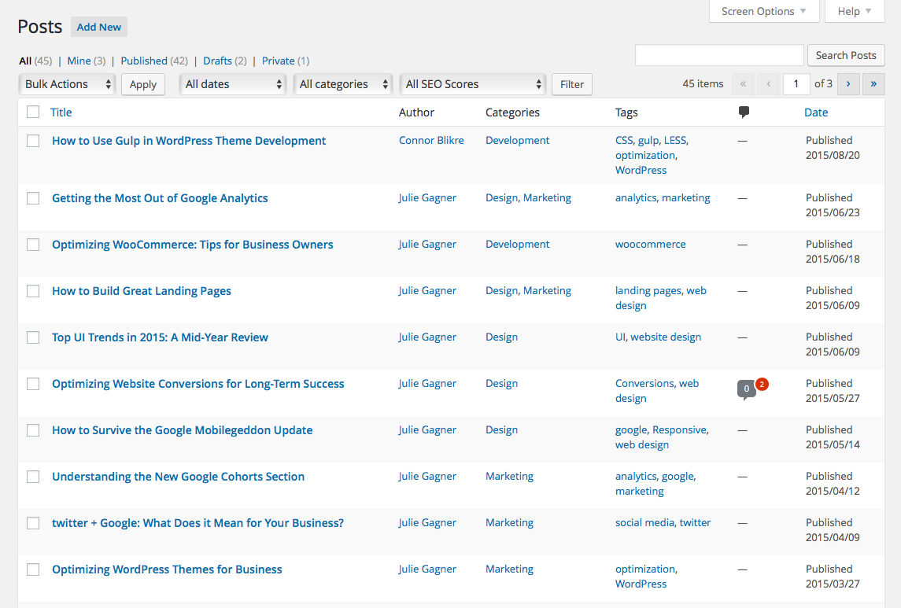
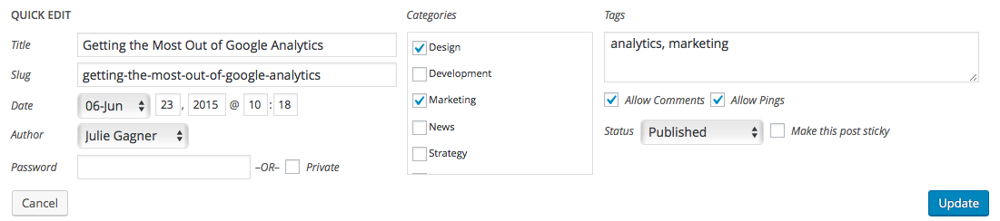

# All Posts Table

When selecting a post type from the main admin navigation menu, whether it be *Posts*, *Pages*, or some other custom post type, the landing page you're presented with contains and index of all the posts of that kind. The posts are organized into a table with columns displaying different pieces of data associated with the entry. The columns that are visible can be toggled on or off using the options in the *Screen Options* tab at the top right of the page.

The listed posts can be filtered by the post status links along the top (published, draft, pending, etc.) as well as through the drop downs for other post data, such as date published or the post's category. Additionally, there's a search box on the upper right side of the page that'll allow you search specific keywords within this post type.

Hovering over one of the items in the table will reveal a few actions that can be performed on that entry. Clicking on the title of the post or the *Edit* link that appears below it will take you to the editor for that entry. The *Trash* and *View* links are pretty self explanatory, deleting the item and linking to the post within the website, respectively.

One of the other options you'll see when hovering over a post is the *Quick Edit* link. Clicking this will open up a form inline that allows you to manipulate basic low-level data associated with this post. This can be useful if you just want to make a quick change to the title or slug[^1] of the post without needing to open the full-blown post editor page.

[^1] A post’s slug is what’s used to determine the URL to the particular post’s page on the website.