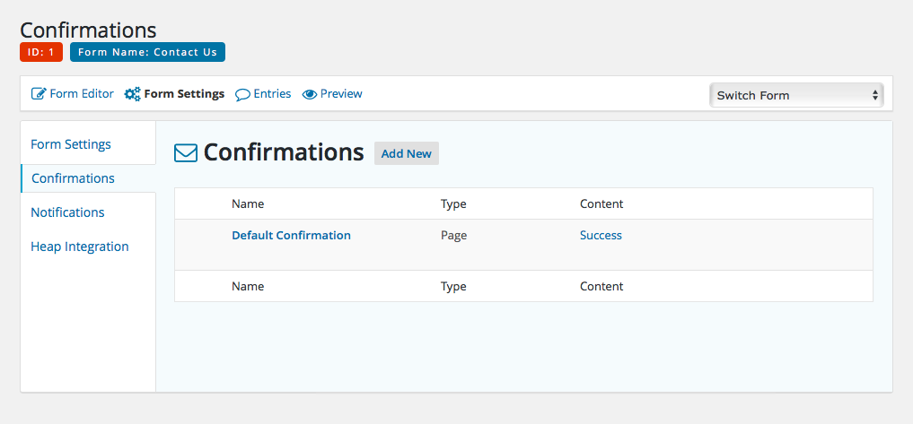
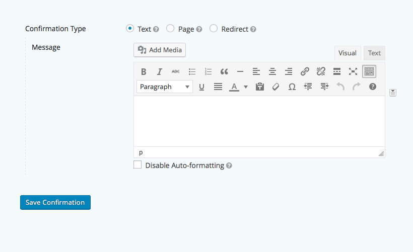

# Confirmations

A form confirmation is the alert/message the user receives directly on the site immediately after successfully completing a form. Confirmations can be managed under the *Confirmation* submenu item under the *Form Settings* link.

Selecting an existing confirmation, or clicking on the *Add New* button to the right of this tab's title, will open the editor for that particular confirmation.

Confirmations can either take the form of a textual message (that will appear in place of the form once submitted), sending the visitor to another page on the site, or some other form of browser redirect.