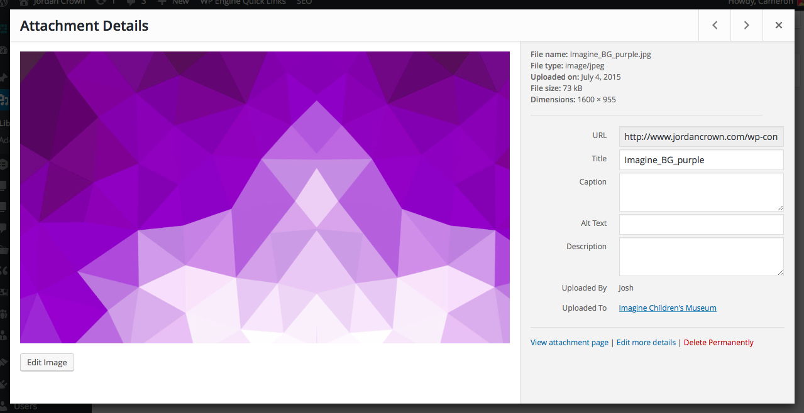
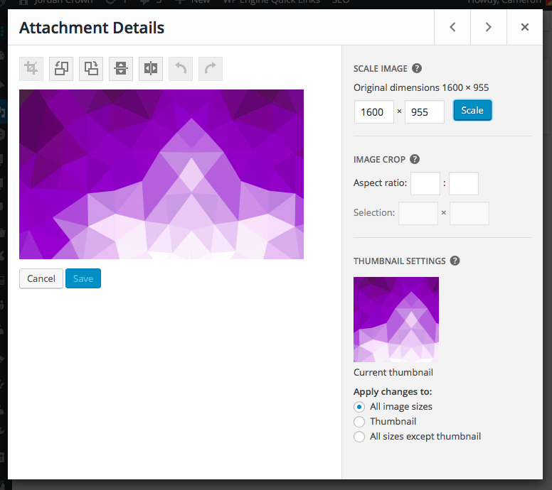

# Editing Media

Selecting a file from the media library index will bring up the attachment details dialog window for editing various meta field for the upload.

You can update the attachment's title, caption, alt text, or description. The use of this data is entirely dependent on how you choose to use the asset. For example, when adding an image to the content of a post/page, you have the option to redefine these attributes before converting it to HTML code for embed.

The attachment details window may also provide some details on what user uploaded the file and what post/page it was originally embedded in.

If you select an image, you'll notice an Edit Image button below the preview on the left side of the dialog window. Clicking this button will change the window to image edit mode where basic photo manipulation can be done. Images can be cropped, resized, flipped, or rotated. Once your finished editing, be sure to hit the Save button to return you to the attachment details editor mode.

