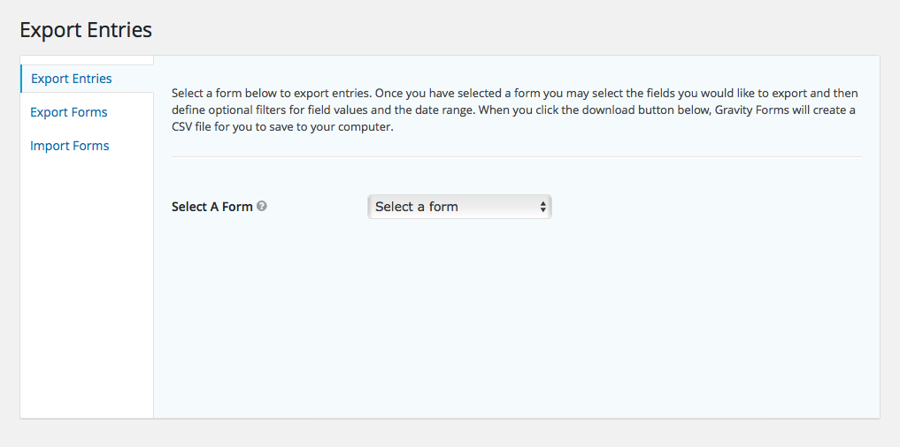

# Exporting Form Submissions

The *Gravity Forms* plugin comes with entry export functionality that allows you to download the submission data for any form in CSV format. You can access this tool from the *Import/Export* submenu item under the *Forms* admin menu section.

Once you’ve selected a form from which you want to export entries, you’ll be able to select what fields to include in the download and filter entries based on submitted data or timeframe.