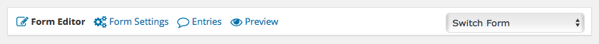
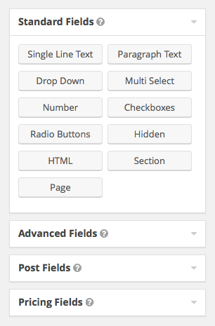
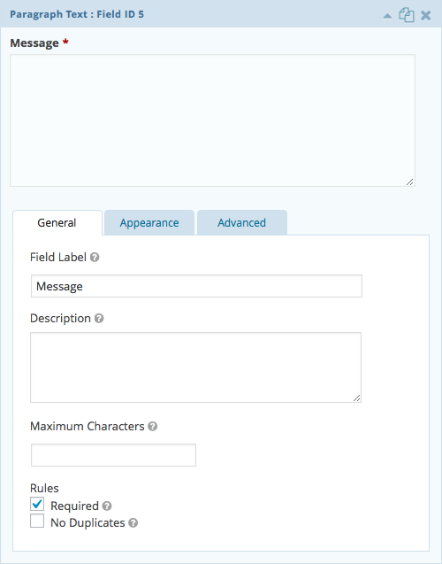

# Form Editor

Selecting an existing form, or creating a new form, in the *Forms* section of the WordPress admin will take you to the form editor page. The left column of this interface will contain the fields that make up the current form while the right side has field options that can be added.

Along the top of the form editor, or any settings subpage for a particular form, is the form settings navigation.

Hovering over the *Form Settings* menu item will reveal links to manage the form's settings, confirmations, and notifications. There's also a drop down on the right to quickly switch between forms that have been created on your site.

## Adding a New Field

Fields can be added to a form by clicking on one of the options in one of the field group panels on the right. The new field will be added to the end of the form. Alternatively, the field type of your choice may be dragged to the desired position within the form.

Once a field has been added to your form, it may be dragged up/down to reorder its position or selected to reveal its configuration options.

## Editing Field Options

Selecting a field that has been added to your form will open up that field's options panel. The settings tabs and fields contained within this panel will vary depending on the type of field it is.

Keep in mind, whenever finished making changes to a form, be sure to hit the *Update Form* button. This will also update any forms of this kind that may have already been embedded on pages of your site.
