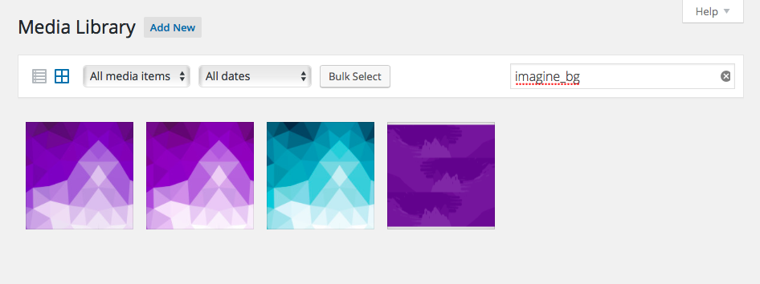

# Media Library

The media library serves as a central repository for all the files you upload to your WordPress site. You can upload images, videos, or other kinds of documents directly to this section of the admin or interact with the media manager modal when embedding content into posts/pages. Regardless of where the asset is uploaded, it will always show up in the media library section.

