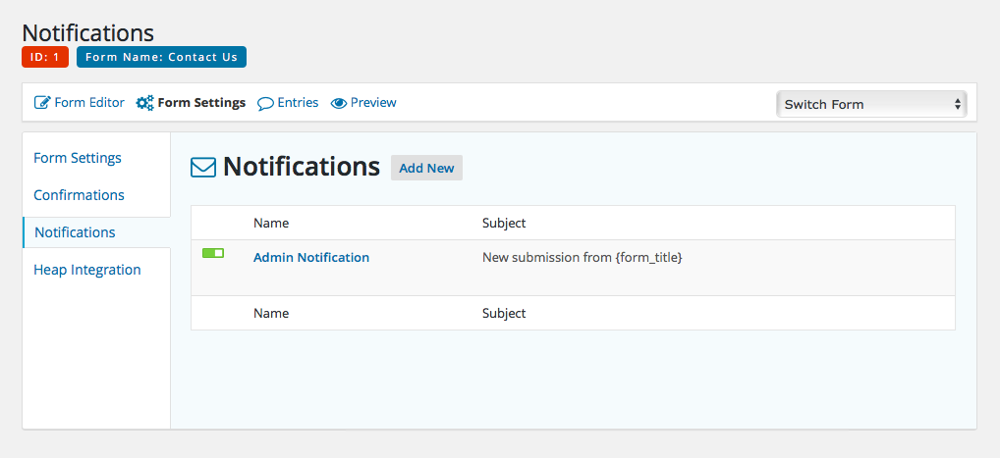

# Notifications

Various email notifications can be configured to be sent out whenever a form submission is completed. Notifications can be managed under the *Notifications* submenu item under the *Form Settings* link.

On the form settings tab that lists all the notifications that have been configured for the form, individual notifications can be toggled on and off by clicking on the toggle control on to the left of the particular item. Selecting an existing notification, or clicking on the *Add New* button to the right of this tab's title, will open the editor for that particular notification.

There are many different options that can be configured for each notification. You can control who the email will be sent to, what the subject line will be, as well as the email content itself. Throughout these settings, you have the option of inserting placeholders into the various fields to feed in values from the form submission to customize the notification's output based on the data provided by the submitter.