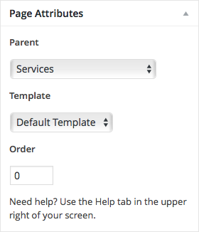

# Page Fields

In addition to the standard title, content, and publish field groups outlined in [*Managing Content Types*](managing_content_types.md) section previously, pages have several field groups specific to their post type. The following sections will outline the basics of the main sections unique to the page editor form. Keep in mind, if some of the panels are not showing up for you, they may just be toggled off in the Screen Options tab at the top right of the page.

## Page Attributes

The *Page Attributes* panel has a few setting controls on how the page should behave on your site.

Setting the page's parent will update the URL structure to that page to behave as a subdirectory of the parent's path. This would be useful if you want to have a set of subpages with more detailed information relating to a common parent page.

If multiple templates are available in your theme, you have the option of selecting which page template to use. This will determine how the content of the page is laid out on the front end of the website. This may also affect what kind of additional functionality is added to the page.

The *Order* field controls the custom sorting mechanism for pages at the same level. In other words, all sibling pages can have their natural order set by defining the desired index for each page in the collection in ascending order. Please note, this may not affect the order in which the pages are presented in navigation menus, as those are controlled independently.
