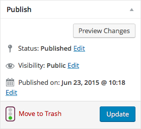

# Post Editor

Creating a new post, or selecting an existing one, will open up the post editor page within the WordPress admin. To create a new post, you can either click the *Add New* submenu item under the desired post type section in the main admin navigation, click the *Add New* button to the right of the title above the all posts table, or select the type of post you want to add from the *+New* dropdown in the user toolbar.

The kinds of fields that show up on the post editor page varies between post types between on the type's purpose. However, in general, all species of posts will have a title and some primary content attributed to it. Other sections of this user will go into detail, outlining the different kinds of inputs and field groups you may encounter when editing posts of different types, but lets go over some of the common ones here.

## Title

The post title field will appear at the very top of the post editor page.

The title of the entry also determines the initial slug defined for the post. The post slug is shown right below the title field in the context of the full URL to the post's page on the website. You may override the default slug here, allowing you to have more control over link structure.

## Content

This is generally the meat of any kind of post type. A post's content is usually managed through WordPress' WYSIWYG[^1] editor.

This rich text editor allows you to have more control over the formatting and style of the copy you write for your post. There are several options in the editor's toolbar that allows you to manipulate the appearance of your text. Alternatively, if you'd prefer to edit the content using HTML markup, you can switch the editor's mode by selecting the *Text* tab at the top right of the field. For the more experienced users, this can be helpful at times, but for those not familiar with HTML tags, it's not recommended.

### Adding Images and Other Media

Paired with the content editor fields, you'll usually find buttons for adding media and forms.

Clicking on the *Add Media* button will open up the media library dialog window where you can upload, select, edit, and embed images, videos, and other types documents into your post's content.

Once you've selected media to embed, you can edit the title or provide some alt text or a caption to be included. Once you're all set, hit the *Insert into post* button and the media will show up in the content editor.

There's also an option to embed a collection of images into your content using the *Create Gallery* tab in the left column of this window.

Clicking the *Add Form* button above the content editor will open up the form insert dialog window.

Select from the forms that have been created in *Forms* section of the WordPress admin to embed directly in your content. You may also configure some options that would affect the presentation and behavior of the form when viewing on the website.

## Publishing

The *Publish* panel contains miscellaneous options related to the state of the post. When you are finished editing a post, you must always hit the *Update* (or *Publish* if creating a new post) to save your changes. You'll also find settings for post status (published, pending, or draft), visibility (public, password-protected, or private), and the date of publication.

[^1] What You See is What You Get