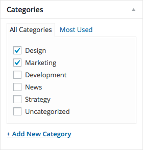
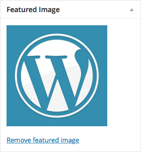
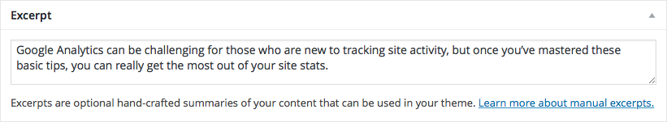
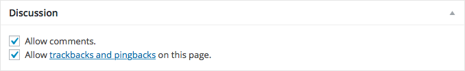
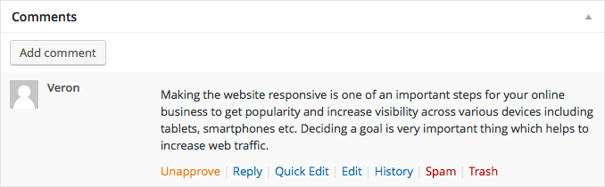
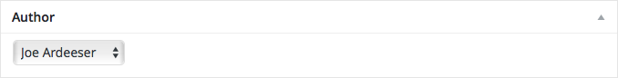

# Post Fields

In addition to the standard title, content, and publish field groups outlined in [*Managing Content Types*](managing_content_types.md) section previously, posts have several field groups specific to their post type. The following sections will outline the basics of the main sections unique to the post editor form. Keep in mind, if some of the panels are not showing up for you, they may just be toggled off in the *Screen Options* tab at the top right of the page.

## Categories

You may want to categorize your post into one or more categories. This can easily be done by checking off one of the existing post categories available in the list of options, or clicking the Add New Category link and creating a completely new one.

## Tags

Posts can be tagged with multiple keywords to easily identify the important information within the post. Tags can be attached by providing the desired words/phrases in the text field or by selecting from the collection of most used tags.

## Featured Image

The featured image of a post may show up next to the article in the blog index or on the post's website page itself. You can set a featured image by clicking the *Set featured image* link and uploading/selecting an image from the media manager dialog window.

## Excerpt

On website pages such as the blog or post category indexes, the template will generate excerpts for your posts to provide a teaser for the reader. You may override the teaser by providing a quick summary or lead in for the post's content in the excerpt field.

## Discussion

The *Discussion* panel contains options to enable/disable comments or trackbacks and pingbacks[^1] to the post. If you want to disable the comment form for a particular post, uncheck the *Allow comments* setting.

## Comments

Comments for the particular post can be managed within the post editor. You can approve, edit, delete, or even mark comments as spam. Comments can even be added or replied to from within the *Comments* panel.

## Author

The *Author* field allows you to reassign the user for which the post should be credited to.

[^1]: Trackbacks and pingbacks are methods of notifying systems that their content has been referenced on external sites.