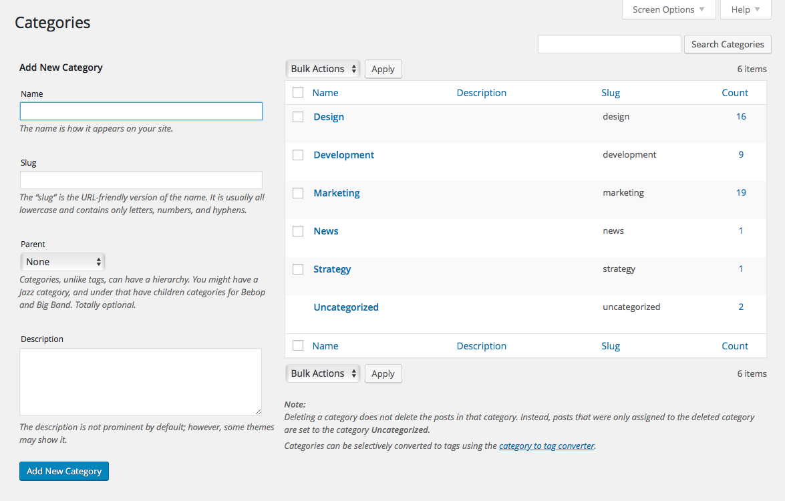

# Taxonomy Term Manager

Posts of a similar type may be related to one another through one or more taxonomies (e.g. categories, tags). The terms that may be assigned to posts within each taxonomy can be managed within a subpage of the post type's section in WordPress' main admin menu.

In the left column of this page, you can fill out the form for adding a new term to the taxonomy. Similar to how post slugs are handled, a term's slug is initially derived from the name provided, but can be easily overridden with the *Slug* field. For hierarchical taxonomies, you have the ability to assign a parent term to any term you create.

On the right side of the term manager page, all existing terms within the taxonomy are listed out. This table is very similar to the all posts table we outlined earlier. The right-most column displays the number of posts each term in the list is attributed to. Hovering over each of the rows of the table reveals several actions that can be performed on the particular term. Clicking on the term's name, or on the Edit link for the term, will take you to the full term editor page where you'll have more options for managing the term's details.