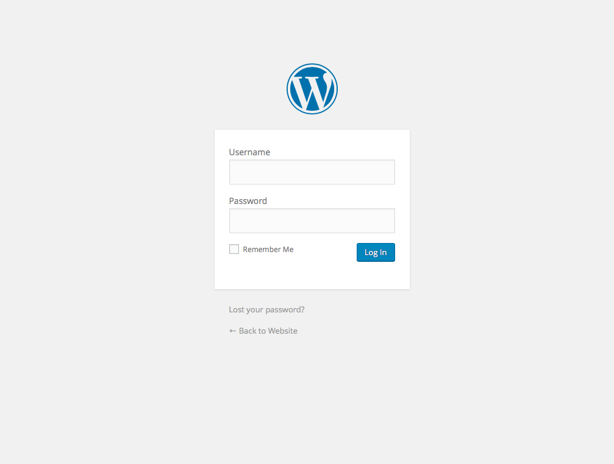

# User Login

Before you can make any changes to your site, you will need to log in. The WordPress admin can be accessed via the following URL:

http://{sitename.com}/wp-admin/

This should bring you to the login page (assuming you haven’t already been authenticated).

Once you have entered your username and password, you will be taken to the WordPress admin dashboard.