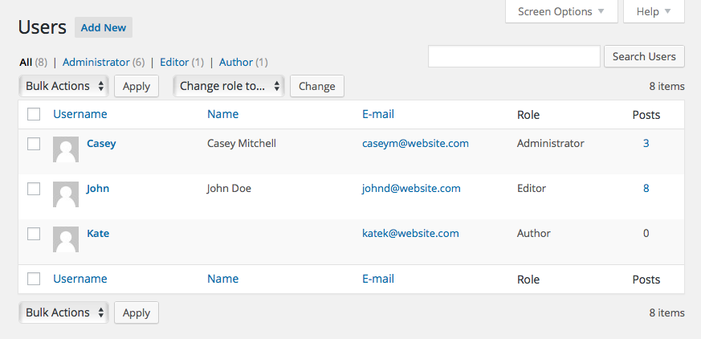

# Users

Each person with an account on your site will show up in the Users section of the WordPress admin. On this page, registered users can be filtered by user role (administrator, editor, etc.) or searched.

## User Roles

Whenever dealing with a user's account, they can be assigned a specific user role that controls their level of access when interacting with your website. Here's a rundown of what each should be used for:

* **Subscriber:** Somebody who can only manage their profile.
* **Contributor:** Somebody who can write and manage their own posts but cannot publish them.
* **Author:** Somebody who can publish and manage their own posts.
* **Editor:** Somebody who can publish and manage posts including the posts of other users.
* **Administrator:** Somebody who has access to all the administration features within a single site.
